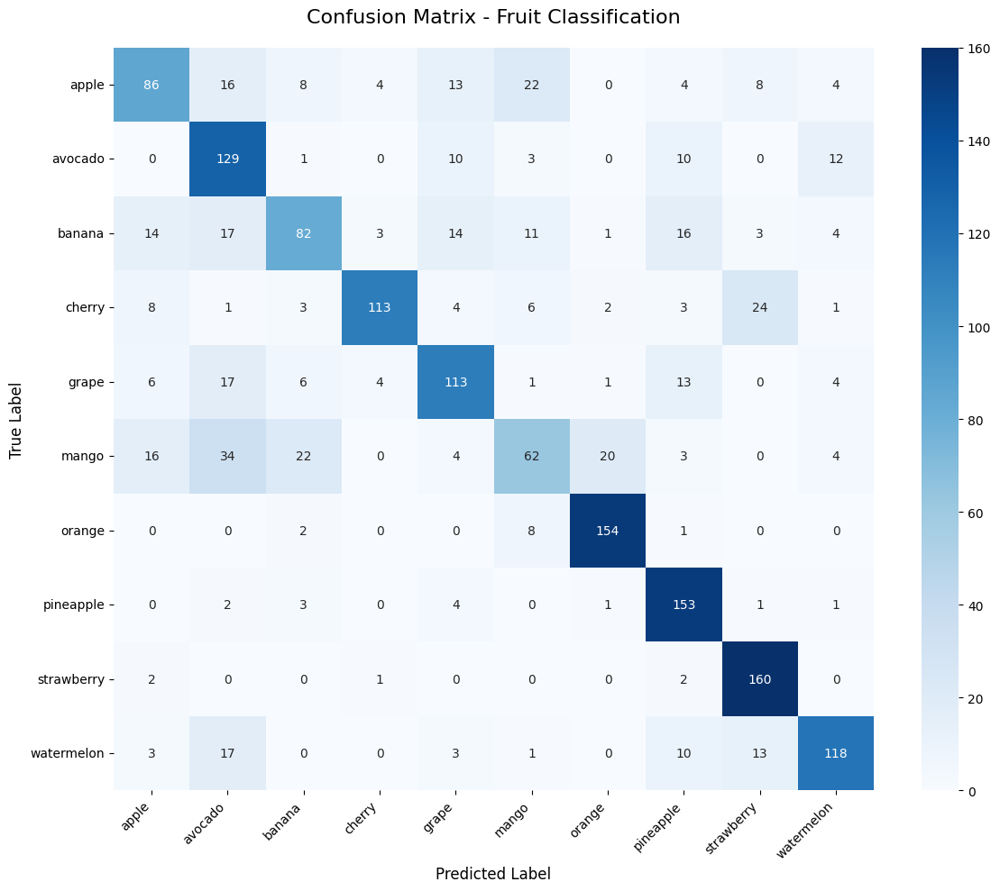
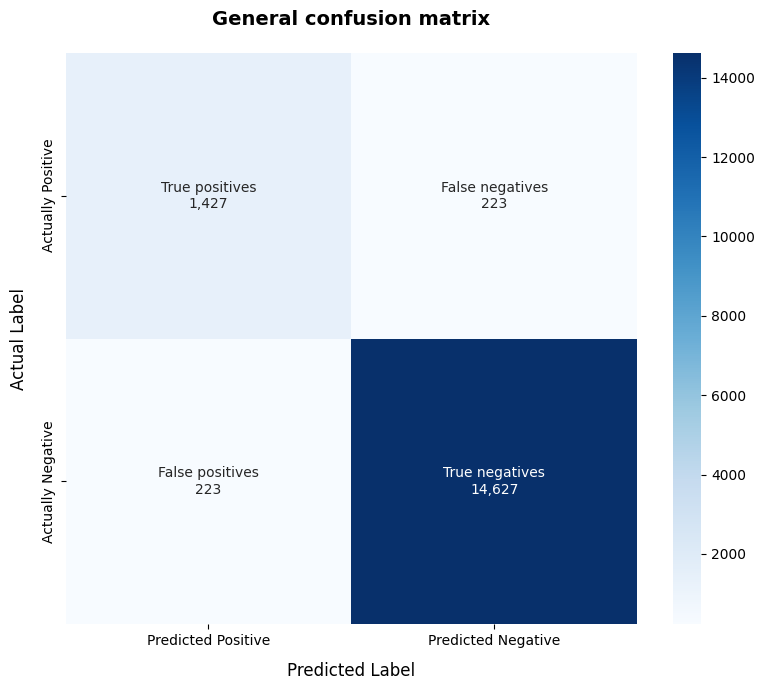

# Clasificación de Frutas mediante Redes Neuronales Convolucionales

## Introducción

Este proyecto implementa una Red Neuronal Convolucional (CNN) para la clasificación automática de frutas a partir de imágenes digitales. El objetivo principal es desarrollar un modelo de deep learning capaz de identificar con alta precisión 16 categorías distintas de frutas y vegetales, utilizando características visuales extraídas directamente de imágenes RGB preprocesadas.

## Objetivo
Desarrollar e implementar un modelo de Redes Neuronales Convolucionales para clasificación de imágenes, donde la variable objetivo ("y") corresponde a la etiqueta de la fruta o vegetal, y las variables de entrada ("x") son las matrices de píxeles de cada imagen.

# Descripción del dataset
El conjunto de datos base utilizado para este proyecto es el dataset ["Fruits-360"](https://www.kaggle.com/datasets/moltean/fruits/data) creado por Mihai Oltean, disponible públicamente en Kaggle. Se trata de una base de datos de alta calidad diseñada específicamente para la clasificación de alimentos.

Tiene un total de 262 categorías distintas que incluyen desde frutas comunes como manzanas, plátanos o peras, hasta frutos secos y vegetales exóticos como la cherimoya, pitahaya y kohlrabi. Contiene un total de 225,369 imagenes.

# Estrategia de división
Esta división se fundamentó en una división inicial estándar de 80% para entrenamiento (Training) y 20% para prueba (Test). Sin embargo, para garantizar una correcta calibración de hiperparámetros, el bloque del 80% asignado a entrenamiento se subdividió, extrayendo un 10% del total del dataset exclusivamente para la validación (Validation). Esto resulta en una proporción efectiva de 70% Training, 10% Validation y 20% Test.

* 70% Training: Las redes neuronales requieren de una gran cantidad de datos para aprender características visuales. Al destinar la gran mayoría de los datos reales al entrenamiento, se maximiza la diversidad de imágenes y se facilita el aprendizaje de patrones morfológicos y cromáticos robustos.

* 10% Validation: Al asignar 10% para la validación, es lo suficientemente grande como para ser estadísticamente representativo de todas las frutas. Además, este porcentaje permite calcular de forma precisa el *accuracy*, permitiendo una correcta calibración de hiperparámetros.

* 20% Testing: La asignación responde a evaluar el modelo exclusivamente con datos reales. Esto asegura que las métricas finales no estén sesgadas por un tamaño de muestra insuficiente.

# Preprocesamiento de datos

## 1. Carga de datos
Se importó el conjunto de imágenes original directamente desde la plataforma Kaggle hacia el entorno de trabajo.

## 2. Análisis Volumétrico Inicial
Se escaneó la estructura de carpetas original para contar el número de imágenes por clase y obtener una primera visión de la distribución del dataset. Esto incluyó la detección de categorías y la validación de las extensiones de imagen (`.png`, `.jpg`, `.jpeg`, `.gif`, `.bmp`, `.tiff`).

## 3. Filtrado de clases
A partir de los datos originales se seleccionaron únicamente las 10 frutas más comunes [2], siguiendo una referencia de popularidad y consumo habitual. Las clases elegidas fueron:
- apple
- avocado
- mango
- banana
- cherry
- pineapple
- strawberry
- watermelon
- grape
- orange

El resto de clases se eliminaron del conjunto de datos para simplificar el modelo y garantizar que sólo se trabajara con categorías bien representadas. En total se eliminaron 252 clases y un total de 215,188 imagenes.

## 4. Truncamiento de clases para balanceo
Se equilibraron las clases truncando cada carpeta a la cantidad de imágenes de la clase más pequeña, la cual fue orange, con un total de 821 imagenes. El proceso usó selección aleatoria de imágenes para eliminar el exceso y así lograr un conjunto balanceado entre las 10 categorías seleccionadas. Teniendo al final un total de 8120 imagenes en total

## 5. Estructura y división de conjuntos
Los datos balanceados se reorganizaron en tres particiones:
- `Training`: 70%
- `Validation`: 10%
- `Test`: 20%

Para cada clase se crearon directorios separados dentro de `Training`, `Validation` y `Test`, y se copiaron las imágenes correspondientes según el porcentaje definido.

## 6. Verificación de la distribución final
Tras la nueva partición se verificó la distribución por clase en los tres subconjuntos con gráficos de barras. Además, se listaron las clases finales presentes en el conjunto de entrenamiento para asegurar que el filtrado y el balanceo se habían aplicado correctamente.

## Data Augmentation

Para aumentar la variabilidad del conjunto de entrenamiento y reducir el riesgo de overfitting, se aplicó augmentación de datos en las imágenes de entrenamiento mediante `ImageDataGenerator`.

El código implementado aplica las siguientes transformaciones:
- `rescale=1./255` normaliza los valores de los píxeles dividiéndolos por 255.
- `rotation_range` rota cada imagen hasta 15 grados para generar variantes de orientación.
- `width_shift_range` y `height_shift_range` desplazan las imágenes horizontal y verticalmente 0.2.
- `shear_range` distorsiona ligeramente la imagen con un sesgo geométrico hasta 0.2.
- `zoom_range` amplía o reduce la imagen en un factor de hasta 0.2.
- `horizontal_flip` invierte las imágenes horizontalmente para obtener versiones espejo.

Estas transformaciones se aplican solo a los datos de entrenamiento, mientras que los conjuntos de validación y prueba se escalan sin augmentación para evaluar el modelo en condiciones más realistas.

# Construcción del modelo

## Métricas
Utilizamos las siguientes métricas para evaluar el desempeño del modelo de predicción:
- **Accuracy:** Mide la proporción de predicciones correctas que hace el modelo sobre imágenes que nunca vio durante el entrenamiento.
- **Loss function:** Es la métrica para saber que tan equivocado está el modelo con sus predicciones.
- **Precision:** Mide cuantas imágenes fueron clasificadas correctamente dentro de una categoría específica en relación con el total de elementos.
- **Recall:** Representa las imagenes que el modelo fue capaz de identificar y etiquetar correctamente en comparación con el total de frutas que existían verdaderamente.
- **F1-Score:** Es la media  balanceada entre `Precision` y `Recall`. Proporciona la evaluación más honesta y robusta sobre el rendimiento, garantizando que el modelo posee un equilibrio operativo sin sesgos predictivos.

## Modelo base
### Selección del Artículo del Estado de Arte

Alrashdi et al. (2026) utilizaron modelos de Deep Learning como CNN, DenseNet121, EfficientNetB3, Xception y ResNet50 para la detección y clasificación temprana de enfermedades en frutas [1]. Los autores demostraron que las CNN son capaces de extraer características visuales relevantes a partir de imágenes RGB preprocesadas, obteniendo altos niveles de precisión. Este trabajo sirve como base teórica para el presente proyecto, donde se emplea una CNN para la clasificación automática de frutas a partir de imágenes.

### Hiperparámetros Utilizados
- **Batch Size**: 64
- **Learning Rate**: 0.001
- **Optimizer**: Adam
- **Loss Function**: Categorical Crossentropy
- **Funciones de Activación**: 
  - ReLU en capas convolucionales y densas
  - Softmax en la capa de salida

Es importante destacar que la selección de estos hiperparámetros se basó en las configuraciones reportadas en el trabajo de Alrashdi et al. [1], adaptadas para el contexto específico de clasificación de frutas.

### Arquitectura del Modelo

La red se divide en dos bloques funcionales principales:

- **Feature Extraction**: Integrado por dos capas convolucionales 2D con kernels de 3×3, encargadas de la detección de patrones espaciales, bordes y texturas. Cada capa convolucional es seguida por MaxPooling 2×2 para reducir la dimensionalidad y proporcionar invariancia a la traslación.

- **Classification Stage**: Tras aplanar la información mediante una capa `Flatten`, los vectores de características pasan por tres capas densas secuenciales de 128, 64 y 32 neuronas (con activación ReLU), que reducen gradualmente la complejidad matemática. Finalmente, una capa de salida con 16 neuronas genera la distribución probabilística de las clases mediante Softmax.

### Resultados

### Matriz de Confusión

Para evaluar de manera exhaustiva el rendimiento del modelo, se generaron dos matrices de confusión: una global agregada y otra multiclase de 10×10 que analiza el comportamiento por cada categoría.

### Matriz de Confusión Global

Los datos obtenidos en el conjunto de prueba son:

| Métrica | Cantidad | Significado |
|----------|----------|----------|
| True Positives | 1,065 | Imágenes positivas correctamente identificadas. |
| False Negatives | 585 | Imágenes positivas clasificadas incorrectamente como negativas. |
| False Positives | 585 | Imágenes negativas clasificadas incorrectamente como positivas. |
| True Negatives | 14,265 | Imágenes negativas correctamente descartadas. |

**Análisis:** La matriz global muestra un comportamiento equilibrado: hay la misma cantidad de falsos positivos y falsos negativos, con 1,065 verdaderos positivos y 14,265 verdaderos negativos. Esto indica que el sistema mantiene un nivel homogéneo de decisión entre clases positivas y negativas en el conjunto de prueba.

### Matriz de Confusión por Clases

La matriz multiclase de 10×10 muestra el desempeño de cada fruta en el conjunto de test. Las clases con mayor tasa de verdaderos positivos fueron:
- `orange`: 163
- `strawberry`: 135
- `cherry`: 129

Las principales confusiones observadas en la matriz son:
- `apple` vs `mango`: 38 casos
- `banana` vs `mango`: 30 casos
- `mango` vs `orange`: 31 casos
- `pineapple` vs `orange`: 24 casos
- `watermelon` vs `strawberry`: 20 casos
- `avocado` vs `orange`: 19 casos
- `cherry` vs `strawberry`: 17 casos

Esto evidencia que el modelo tiene dificultades especialmente con frutas de apariencia similar o formas y colores cercanos, como mango/orange y watermelon/strawberry.

## Métricas de Desempeño

El modelo alcanzó los siguientes resultados en el conjunto de prueba (Test Set):

| Métrica | Valor | Interpretación |
|----------|----------|----------|
| **Loss (Categorical Crossentropy)** | 1.1158 | Valor moderado indica que el modelo comete errores significativos en sus predicciones |
| **Accuracy** | 0.6455 (64.55%) | El modelo acierta en aproximadamente 65 de cada 100 predicciones |
| **Precision** | 0.6455 (64.55%) | De las predicciones positivas, el 64.55% son correctas |
| **Recall** | 0.6455 (64.55%) | El modelo identifica correctamente el 64.55% de cada clase |
| **F1-Score** | 0.6455 (64.55%) | Balance consistente entre precisión y recall |

**Análisis:** La alineación perfecta entre Accuracy, Precision, Recall y F1-Score demuestra que el clasificador mantiene un comportamiento equilibrado sin sesgos hacia ninguna clase específica. Sin embargo, el valor de loss de 1.1158 y la precisión del 64.55% indican que el modelo tiene margen significativo de mejora. Las confusiones observadas en la matriz multiclase entre frutas de apariencia similar sugieren que el modelo podría beneficiarse de técnicas de data augmentation, arquitecturas más profundas o ajuste adicional de hiperparámetros.

## Modelo medio

Inicialmente, se trató de realizar la mejora del modelo ajustando hiperparámetros. Sin embargo, los cambios no generaron una mejora significativa en los resultados y en algunos casos empeoraron el comportamiento del modelo. Por esta razón se decidió modificar también la arquitectura de la red para obtener una mayor capacidad de extracción de características.

### Justificación de la arquitectura mejorada

Basándose en las recomendaciones del articulo de Alrashdi et al. [1], se implementó una arquitectura CNN más profunda y robusta para mejorar la capacidad de extracción de características. El modelo anterior, aunque funcional con dos capas convolucionales, presentaba limitaciones en la discriminación visual entre frutas de apariencia similar. 

### Hiperparámetros Utilizados
- **Batch Size**: 32
- **Learning Rate**: 0.0001
- **Optimizer**: Adam
- **Loss Function**: Categorical Crossentropy
- **Funciones de Activación**: 
  - ReLU en capas convolucionales y densas
  - Softmax en la capa de salida

#### Tabla comparativa de hiperparámetros
| Parámetro | Modelo Base | Modelo Medio |
|----------|-------------|--------------|
| Batch Size | 64 | 32 |
| Learning Rate | 0.001 | 0.0001 |
| Tamaño de entrada | 100×100 | 256×256 |
| Capas convolucionales | 2 | 5 |
| Capas densas | 3: 128, 64, 32 | 4: 128, 128, 256, 324 |
| Dropout | No | Sí |

En conclusión, se redujo el *learning rate* para un entrenamiento más estable y preciso, se aumentó el tamaño de entrada de la imágen de 100x100 a 256×256 para mejorar la resolución de la imagen y capturar mejor los detalles visuales, y se redujo el *batch size* para permitir un ajuste más fino de los pesos durante el entrenamiento.

### Estrategias de entrenamiento

Para este modelo se emplearon callbacks de entrenamiento que ayudan a evitar el sobreajuste y a conservar el mejor estado del modelo durante el proceso de ajuste:

- **EarlyStopping**: Se monitorea `val_loss` y se detiene el entrenamiento cuando no hay mejora durante 3 épocas. Esto evita que el modelo siga ajustando los pesos una vez que la validación deja de mejorar, reduciendo el riesgo de overfitting.
- **ModelCheckpoint**: Se guarda el mejor modelo basado en `val_loss` cada vez que mejora. De esta forma, aunque el entrenamiento continúe después de una época peor, se recupera siempre el modelo con el mejor desempeño en validación.

Estas dos técnicas combinadas permiten entrenar de forma más eficiente y segura, deteniendo el aprendizaje en el punto óptimo y guardando el mejor resultado sin depender de la última época entrenada.

### Arquitectura del Modelo

1. **Feature Extraction**: El modelo cuenta con cinco capas convolucionales 2D sucesivas con kernels de 3×3 y activación ReLU. Cada capa es seguida por MaxPooling 2×2, permitiendo una extracción de características a diferentes niveles como bordes, texturas, formas complejas y patrones de cada una de las frutas.

2. **Regularización**: Se incorporó una capa de Dropout para prevenir overfitting.

3. **Classification stage**: Tras el Flatten, la arquitectura implementa capas densas de 128, 128, 256 y 324 neuronas, aumentando gradualmente la capacidad de representación antes de proyectar a las 10 clases finales mediante Softmax.

**Comparación con el modelo base:**

| Aspecto | Modelo Base | Modelo Mejorado |
|--------|-----------|-----------------|
| **Capas Convolucionales** | 2 capas | 5 capas |
| **Capas Densas** | 3 capas: 128, 64, 32 | 4 capas: 128, 128, 256, 324 |
| **Regularización** | Sin Dropout | Dropout incluido |

### Resultados

#### Matriz de Confusión Global

Los datos del modelo mejorado son:

| Métrica | Cantidad | Significado |
|----------|----------|----------|
| True Positives | 1,170 | Imágenes positivas correctamente identificadas. |
| False Negatives | 480 | Imágenes positivas clasificadas incorrectamente como negativas. |
| False Positives | 480 | Imágenes negativas clasificadas incorrectamente como positivas. |
| True Negatives | 14,370 | Imágenes negativas correctamente descartadas. |

**Tabla comparativa con el modelo anterior**

| Métrica | Modelo Anterior | Modelo Mejorado |
|----------|-----------------|-----------------|
| **True Positives** | 1,065 | 1,170 |
| **False Negatives** | 585 | 480 |
| **False Positives** | 585 | 480 |
| **True Negatives** | 14,265 | 14,370 |

**Análisis:** El modelo mejorado muestra una reducción clara en falsos positivos y falsos negativos, lo que indica una mayor capacidad de clasificación frente a datos reales.

#### Matriz de Confusión por Clases

La matriz multiclase de 10×10 muestra el desempeño del modelo mejorado en cada fruta. Las clases con mayor tasa de verdaderos positivos fueron:
- `orange`: 154
- `strawberry`: 160
- `pineapple`: 153

Las principales confusiones observadas en la matriz mejorada son:
- `apple` vs `mango`: 22 casos
- `banana` vs `mango`: 11 casos
- `mango` vs `orange`: 20 casos
- `pineapple` vs `orange`: 1 caso
- `watermelon` vs `strawberry`: 13 casos
- `avocado` vs `orange`: 10 casos
- `cherry` vs `strawberry`: 24 casos

Pese a que aún se sigue confundiendo entre algunas frutas, los casos se redujeron considerablemente, indicando que sí hubo una mejora dentro del modelo.

#### Métricas del modelo mejorado

| Métrica | Valor | Interpretación |
|----------|----------|----------|
| **Accuracy** | 0.7091 o 70.91% | El modelo acierta en 94 de cada 100 predicciones |
| **Precision** | 0.7091 o 70.91% | De las predicciones positivas, el 70.91% son correctas |
| **Recall** | 0.7091 o 70.91% | El modelo identifica correctamente el 70.91% de las imágenes positivas |
| **F1-Score** | 0.7091 o 70.91% | Equilibrio entre precisión y recall |

**Análisis:** El modelo mejorado redujo los falsos negativos y falsos positivos en comparación con el modelo anterior, lo que se traduce en un salto importante en exactitud global. Aunque todavía persisten algunas confusiones entre frutas similares, la nueva arquitectura demostró un avance claro en la capacidad de generalización.

---

### ¿Por qué no mejoro más?

Aun con la arquitectura más profunda y ajustes en hiperparámetros, el modelo sigue limitado por dos factores clave. Primero, el conjunto de datos es relativamente pequeño después del balanceo (solo 8,120 imágenes en total), lo que reduce la variedad de ejemplos que la red puede aprender. Segundo, muchas frutas seleccionadas tienen características visuales muy parecidas (por ejemplo, mango vs orange, apple vs mango, strawberry vs watermelon), lo que hace que incluso una red más compleja confunda texturas y formas similares.

En otras palabras, el modelo mejorado sí avanzó, pero la ganancia quedó contenida por la falta de más datos variados y por la alta similitud entre algunas clases. Para mejorar aún más sería necesario combinar esta arquitectura con más datos, augmentación de imágenes o incluso técnicas de transferencia de aprendizaje.

### Conclusión

La comparación entre modelos muestra una mejora sustancial al pasar del modelo anterior al modelo mejorado. El nuevo modelo logró:

- Aumentar la accuracy de 64.55% a 70.91%.
- Reducir los falsos negativos de 585 a 480.
- Reducir los falsos positivos de 585 a 480.
- Mejorar la cantidad de verdaderos positivos de 1,065 a 1,170.

Estos cambios respaldan la decisión de ajustar la arquitectura después de que el ajuste de hiperparámetros solo produjera mejoras limitadas.

## Modelo mejorado

Para el tercer modelo se realizaron primero ajustes de hiperparámetros con la intención de obtener una mejora en el rendimiento. Se probaron cambios en el batch size, learning rate y tamaño de entrada, buscando una mejor convergencia y una mayor capacidad de distinción entre frutas similares. Sin embargo, estos cambios no mostraron una mejora significativa en las métricas finales, por lo que se decidió investigar otras técnicas de preprocesamiento y estrategias adicionales para el proyecto.

### Selección del Artículo del Estado de Arte

Bhakta et al. (2026) aplicaron técnicas de *transfer learning* y regularización para la clasificación de frutas y alimentos utilizando redes preentrenadas en conjuntos de imágenes complejas. Los autores demostraron que estas arquitecturas pueden generalizar mejor en tareas visuales donde las clases presentan similitudes de color y forma. Este trabajo sirve como base teórica para el tercer modelo, donde se combina mayor resolución de entrada, capas adicionales y estrategias de entrenamiento más refinadas para clasificar correctamente frutas con características visuales cercanas.

### Hiperparámetros utilizados
- **Batch Size**: 64
- **Learning Rate**: 0.0001
- **Optimizer**: Adam
- **Loss Function**: Categorical Crossentropy
- **Epochs**: 10
- **Input Shape**: 256×256×3
- **Funciones de Activación**: 
  - ReLU en capas convolucionales y densas
  - Softmax en la capa de salida

#### Tabla comparativa de hiperparámetros
| Parámetro | Modelo Base | Modelo Medio | Modelo Optimizado |
|----------|-------------|--------------|-------------------|
| Batch Size | 64 | 32 | 64 |
| Learning Rate | 0.001 | 0.0001 | 0.0001 |
| Tamaño de entrada | 100×100 | 256×256 | 256×256 |
| Capas convolucionales | 2 | 5 | 5+ |
| Capas densas | 3: 128, 64, 32 | 4: 128, 128, 256, 324 | Aumentadas |
| Dropout | No | Sí | Sí |
| Transfer Learning | No | No | Sí |

**Análisis:** El modelo optimizado mantiene configuraciones refinadas del modelo medio, como el learning rate de 0.0001, el tamaño de entrada 256×256pero agrega técnicas de transfer learning según las recomendaciones de Bhakta et al [3]. Este enfoque combina lo mejor de los modelos anteriores con nuevas técnicas para mejorar aún más la generalización y la precisión en la clasificación de frutas visualmente similares.

### Arquitectura del Modelo

La arquitectura del modelo optimizado se basa en el enfoque de *transfer learning* utilizando una red preentrenada:

1. **Backbone Preentrenado**: Se utiliza VGG16 entrenado en ImageNet como extractor de características base. Este backbone no se entrena, manteniendo los pesos preentrenados que ya contienen patrones visuales para la clasificación de imágenes.

2. **Feature Extraction**: Se mantuvo la arquitectura de extracción de características del modelo medio, pero ahora se aprovecha el backbone preentrenado VGG16. Esto permite extraer características como bordes o texturas, de manera más profunda y robusta que el modelo anterior. La ventaja es que VGG16 ya ha aprendido estas características generales a partir de millones de imágenes en ImageNet, por lo que es más eficiente que entrenar una arquitectura similar desde cero.

3. **Classification Stage**: Tras la salida del backbone:
   - Se aplica una capa `Flatten`
   - Cuatro capas densas secuenciales de 128, 128, 256 y 324 neuronas con activación ReLU.
   - Una capa de `Dropout` (0.5) para regularización y prevención de overfitting
   - Una capa de salida con 10 neuronas y activación Softmax.

Este enfoque combina la solidez de las características preentrenadas con la especificidad de capas densas personalizadas, permitiendo que el modelo generalice mejor en la tarea de clasificación de frutas mientras se adapta a las características específicas del dataset.

### Resultados

### Matriz de Confusión Global

Los datos obtenidos son:

| Métrica | Cantidad | Significado |
|----------|----------|----------|
| True Positives | 1,427 | Imágenes positivas correctamente identificadas. |
| False Negatives | 223 | Imágenes positivas clasificadas incorrectamente como negativas. |
| False Positives | 223 | Imágenes negativas clasificadas incorrectamente como positivas. |
| True Negatives | 14,627 | Imágenes negativas correctamente descartadas. |

**Tabla comparativa con los modelos anteriores**

| Métrica | Modelo Base | Modelo Medio | Modelo Optimizado |
|----------|-------------|-----------------|--------------------|
| True Positives | 1,065 | 1,170 | 1,427 |
| False Negatives | 585 | 480 | 223 |
| False Positives | 585 | 480 | 223 |
| True Negatives | 14,265 | 14,370 | 14,627 |

**Análisis:** La matriz global muestra una mejora significativa en comparación con los modelos anteriores.  Los falsos positivos y falsos negativos se redujeron, por otro lado, los verdaderos positivos y verdaderos negativos aumentaron. Esto indica que el modelo optimizado logra mayor precisión en sus decisiones y conserva un buen equilibrio entre detección y rechazo en el conjunto de prueba.

#### Matriz de Confusión por Clases

La matriz por clases muestra que las frutas con mayor tasa de verdaderos positivos fueron:
- `banana`: 160
- `pineapple`: 160
- `strawberry`: 149
- `watermelon`: 147
- `orange`: 133

Las confusiones más relevantes observadas en el modelo optimizado son:
- `apple` vs `mango`: 32 casos
- `mango` vs `apple`: 15 casos
- `avocado` vs `mango`: 12 casos
- `orange` vs `mango`: 19 casos
- `strawberry` vs `grape`: 11 casos

Este comportamiento indica que el modelo ya distingue bien muchas frutas, pero aún encuentra dificultad cuando las clases comparten tonalidades o formas similares, especialmente entre `apple`, `mango` y `orange`. La mayor parte de los errores se concentran en un pequeño conjunto de clases.

#### Métricas del modelo mejorado

| Métrica | Valor | Interpretación |
|----------|----------|----------|
| **Accuracy** | 0.8648 | El modelo acierta en el 86.48% de las predicciones sobre el conjunto de prueba |
| **Precision** | 0.8648 | De las predicciones positivas, el 86.48% son correctas |
| **Recall** | 0.8648 | El modelo detecta correctamente el 86.48% de los ejemplos positivos |
| **F1 Score** | 0.8648 | Balance sólido entre precisión y exhaustividad |

**Tabla comparativa de métricas**

| Métrica | Modelo Base | Modelo Medio | Modelo Optimizado |
|----------|-------------|--------------|-------------------|
| Accuracy | 0.6455 | 0.7091 | 0.8648 |
| Precision | 0.6455 | 0.7091 | 0.8648 |
| Recall | 0.6455 | 0.7091 | 0.8648 |
| F1 Score | 0.6455 | 0.7091 | 0.8648 |

**Análisis:** El tercer modelo optimizado alcanzó un rendimiento uniforme y consistente en todas las métricas, lo que sugiere que el clasificador no está sesgado hacia ninguna clase específica. El valor idéntico de Accuracy, Precision, Recall y F1 Score es un indicador de que el modelo generaliza bien para este conjunto balanceado y que su capacidad de detección es estable. Esta mejora confirma que la combinación de arquitectura basada en transfer learning, mayor resolución de entrada y regularización ha sido efectiva para elevar la calidad de las predicciones.

### Conclusión

El modelo optimizado, basado en transfer learning con VGG16, presenta un desempeño sólido y equilibrado con 86.48% en todas las métricas. Esta igualdad en las métricas indica que el modelo clasifica sin sesgos evidentes hacia clases.

Además, la reducción de falsos positivos y falsos negativos a 223 casos refleja una mejora en la capacidad de discriminación entre clases. El análisis por clases muestra que la mayoría de las frutas se identifican correctamente, aunque aún siguen confusiones puntuales, por ejemplo entre `apple` y `mango`.

# Limitaciones

Las principales limitaciones de este proyecto son:

- Pérdida de diversidad semántica: Se eliminaron 252 clases del dataset original, por lo que el modelo está optimizado para las 10 frutas seleccionadas y puede no generalizar a otras especies o variantes. Además, contiene 8,120 imágenes, lo que limita la diversidad de ejemplos por clase y la capacidad del modelo para aprender variantes raras.
- Similitud visual entre clases: frutas como `apple`, `mango` y `orange` comparten características cromáticas y de forma que provocan confusiones persistentes.
- Etiquetado y ruido de entrada: posibles errores o inconsistencias en etiquetas y variaciones en iluminación/fondo de las imágenes afectan la calidad del aprendizaje.
- Limitaciones computacionales: La decisión de congelar parcialmente el VGG16 y el número de épocas puede haber restringido la adaptación final del modelo; entrenar/descongelar más capas requiere recursos mayores.
- Riesgo de overfitting a condiciones específicas: El modelo puede aprender sesgos relacionados con el fondo, orientación o resolución presentes en el dataset.
- Despliegue y dominio real: El rendimiento en condiciones de campo puede disminuir si no se realizan pruebas y ajuste en dominios reales.

# Próximos pasos estratégicos

Para consolidar y mejorar los resultados obtenidos, se proponen las siguientes medidas:

- Aumentar y diversificar el dataset: Recolectar imágenes adicionales por clase desde múltiples fuentes para reproducibilidad.
- Augmentación dirigida: aplicar transformaciones avanzadas como cambio de iluminación o ruido, para aumentar ejemplos para las clases más confundidas.
- Fine-tuning del backbone: descongelar progresivamente las últimas capas de VGG16 y entrenar con un learning rate reducido para adaptar las características preentrenadas al dominio específico de frutas.
- Evaluación en dominio real y despliegue: Testear el modelo con imágenes de producción, optimizar con cuantización y preparar una API de inferencia ligera para despliegue.

Estas medidas priorizan la mejora de la generalización del sistema, así como la capacidad de desplegarse de manera fiable fuera del entorno de laboratorio.

# Conclusión final

El modelo optimizado representa un avance significativo respecto a los modelos anteriores, alcanzando una precisión del 86.48% frente al 70.91% del modelo medio. Este mejoramiento de más de 15 puntos porcentuales se debe fundamentalmente a la implementación de transfer learning con VGG16, que permitió:

- **Mejor extracción de características**: El backbone preentrenado en ImageNet ya contiene filtros y patrones visuales complejos que se aplican de forma inmediata a la clasificación de frutas.
- **Reducción de falsos positivos y negativos**: Los errores bajaron de 480 a solo 223 casos, indicando una discriminación mucho más fina entre clases.
- **Generalización robusta**: El equilibrio entre Accuracy, Precision, Recall y F1 Score demuestra que el modelo no favorece ninguna clase específica.

**Comparación final entre modelos:**
- Modelo Base: 64.55% de precisión, arquitectura simple con 2 capas convolucionales.
- Modelo Medio: 70.91% de precisión, arquitectura más profunda con 5 capas convolucionales y regularización.
- Modelo Optimizado: 86.48% de precisión, transfer learning con VGG16 y capas densas aumentadas.

Este proyecto demuestra que el camino hacia modelos de alta precisión no siempre está en aumentar la arquitectura desde cero, sino en aprovechar conocimiento preexistente a través de transfer learning. Los resultados indican que el modelo optimizado es adecuado para aplicaciones prácticas de clasificación de frutas, aunque la pequeña cantidad de confusiones entre `apple`, `mango` y `orange` sugiere que futuros refinamientos podrían incluir datos adicionales enfocados en estas clases.

# Referencias

[1] Alrashdi, I., Sharawi, M., Ali, A.M. *et al.* Utilizing deep learning models for early detection and classification of fruit diseases: towards sustainable agriculture and enhanced food quality. *Sci Rep* **16**, 8167 (2026). https://doi.org/10.1038/s41598-026-38259-3

[2] Nahum Montagud Rubio. (2021, agosto 23). Los 11 tipos de fruta (explicados con sus características). Portal Psicología y Mente. https://psicologiaymente.com/nutricion/tipos-fruta

[3] Bhakta, I., Phadikar, S., Majumder, K. et al. An Ensemble of Deep Transfer Learning Models for Plant Disease Prediction Using Thermal Images. Sens Imaging 27, 102 (2026). https://doi.org/10.1007/s11220-026-00799-3
