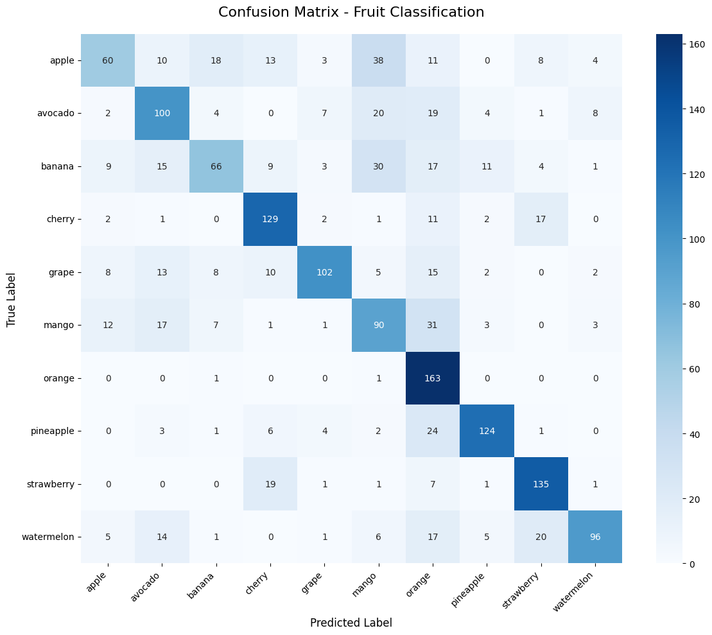

# Clasificación de Frutas mediante Redes Neuronales Convolucionales

## Introducción

Este proyecto implementa una Red Neuronal Convolucional (CNN) para la clasificación automática de frutas a partir de imágenes digitales. El objetivo principal es desarrollar un modelo de deep learning capaz de identificar con alta precisión 16 categorías distintas de frutas y vegetales, utilizando características visuales extraídas directamente de imágenes RGB preprocesadas.

## Objetivo
Desarrollar e implementar un modelo de Redes Neuronales Convolucionales para clasificación de imágenes, donde la variable objetivo ("y") corresponde a la etiqueta de la fruta o vegetal, y las variables de entrada ("x") son las matrices de píxeles de cada imagen.

# Descripción del dataset
El conjunto de datos base utilizado para este proyecto es el dataset ["Fruits-360"](https://www.kaggle.com/datasets/moltean/fruits/data) creado por Mihai Oltean, disponible públicamente en Kaggle. Se trata de una base de datos de alta calidad diseñada específicamente para la clasificación de alimentos.

Tiene un total de 262 categorías distintas que incluyen desde frutas comunes como manzanas, plátanos o peras, hasta frutos secos y vegetales exóticos como la cherimoya, pitahaya y kohlrabi. Contiene un total de 225,369 imagenes.

# Estrategia de división
Esta división se fundamentó en una división inicial estándar de 80% para entrenamiento (Training) y 20% para prueba (Test). Sin embargo, para garantizar una correcta calibración de hiperparámetros, el bloque del 80% asignado a entrenamiento se subdividió, extrayendo un 10% del total del dataset exclusivamente para la validación (Validation). Esto resulta en una proporción efectiva de 70% Training, 10% Validation y 20% Test.

* 70% Training: Las redes neuronales requieren de una gran cantidad de datos para aprender características visuales. Al destinar la gran mayoría de los datos reales al entrenamiento, se maximiza la diversidad de imágenes y se facilita el aprendizaje de patrones morfológicos y cromáticos robustos.

* 10% Validation: Al asignar 10% para la validación, es lo suficientemente grande como para ser estadísticamente representativo de todas las frutas. Además, este porcentaje permite calcular de forma precisa el *accuracy*, permitiendo una correcta calibración de hiperparámetros.

* 20% Testing: La asignación responde a evaluar el modelo exclusivamente con datos reales. Esto asegura que las métricas finales no estén sesgadas por un tamaño de muestra insuficiente.

# Preprocesamiento de datos

## 1. Carga de datos
Se importó el conjunto de imágenes original directamente desde la plataforma Kaggle hacia el entorno de trabajo.

## 2. Análisis Volumétrico Inicial
Se escaneó la estructura de carpetas original para contar el número de imágenes por clase y obtener una primera visión de la distribución del dataset. Esto incluyó la detección de categorías y la validación de las extensiones de imagen (`.png`, `.jpg`, `.jpeg`, `.gif`, `.bmp`, `.tiff`).

## 3. Filtrado de clases
A partir de los datos originales se seleccionaron únicamente las 10 frutas más comunes [2], siguiendo una referencia de popularidad y consumo habitual. Las clases elegidas fueron:
- apple
- avocado
- mango
- banana
- cherry
- pineapple
- strawberry
- watermelon
- grape
- orange

El resto de clases se eliminaron del conjunto de datos para simplificar el modelo y garantizar que sólo se trabajara con categorías bien representadas. En total se eliminaron 252 clases y un total de 215,188 imagenes.

## 4. Truncamiento de clases para balanceo
Se equilibraron las clases truncando cada carpeta a la cantidad de imágenes de la clase más pequeña, la cual fue orange, con un total de 821 imagenes. El proceso usó selección aleatoria de imágenes para eliminar el exceso y así lograr un conjunto balanceado entre las 10 categorías seleccionadas. Teniendo al final un total de 8120 imagenes en total

## 5. Estructura y división de conjuntos
Los datos balanceados se reorganizaron en tres particiones:
- `Training`: 70%
- `Validation`: 10%
- `Test`: 20%

Para cada clase se crearon directorios separados dentro de `Training`, `Validation` y `Test`, y se copiaron las imágenes correspondientes según el porcentaje definido.

## 6. Verificación de la distribución final
Tras la nueva partición se verificó la distribución por clase en los tres subconjuntos con gráficos de barras. Además, se listaron las clases finales presentes en el conjunto de entrenamiento para asegurar que el filtrado y el balanceo se habían aplicado correctamente.

# Construcción del modelo

## Selección del Artículo del Estado de Arte

Alrashdi et al. (2026) utilizaron modelos de Deep Learning como CNN, DenseNet121, EfficientNetB3, Xception y ResNet50 para la detección y clasificación temprana de enfermedades en frutas [1]. Los autores demostraron que las CNN son capaces de extraer características visuales relevantes a partir de imágenes RGB preprocesadas, obteniendo altos niveles de precisión. Este trabajo sirve como base teórica para el presente proyecto, donde se emplea una CNN para la clasificación automática de frutas a partir de imágenes.

## Hiperparámetros Utilizados
- **Batch Size**: 64
- **Learning Rate**: 0.001
- **Optimizer**: Adam
- **Loss Function**: Categorical Crossentropy
- **Funciones de Activación**: 
  - ReLU en capas convolucionales y densas
  - Softmax en la capa de salida

Es importante destacar que la selección de estos hiperparámetros se basó en las configuraciones reportadas en el trabajo de Alrashdi et al. [1], adaptadas para nuestro contexto específico de clasificación de frutas.

## Arquitectura del Modelo

La red se divide en dos bloques funcionales principales:

- **Feature Extraction**: Integrado por dos capas convolucionales 2D con kernels de 3×3, encargadas de la detección de patrones espaciales, bordes y texturas. Cada capa convolucional es seguida por MaxPooling 2×2 para reducir la dimensionalidad y proporcionar invariancia a la traslación.

- **Classification Stage**: Tras aplanar la información mediante una capa `Flatten`, los vectores de características pasan por tres capas densas secuenciales de 128, 64 y 32 neuronas (con activación ReLU), que reducen gradualmente la complejidad matemática. Finalmente, una capa de salida con 16 neuronas genera la distribución probabilística de las clases mediante Softmax.

## Métricas
Utilizamos las siguientes métricas para evaluar el desempeño del modelo de predicción:
- **Accuracy:** Mide la proporción de predicciones correctas que hace el modelo sobre imágenes que nunca vio durante el entrenamiento.
- **Loss function:** Es la métrica para saber que tan equivocado está el modelo con sus predicciones.
- **Precision:** Mide cuantas imágenes fueron clasificadas correctamente dentro de una categoría específica en relación con el total de elementos.
- **Recall:** Representa las imagenes que el modelo fue capaz de identificar y etiquetar correctamente en comparación con el total de frutas que existían verdaderamente.
- **F1-Score:** Es la media  balanceada entre `Precision` y `Recall`. Proporciona la evaluación más honesta y robusta sobre el rendimiento, garantizando que el modelo posee un equilibrio operativo sin sesgos predictivos.

# Resultados

## Matriz de Confusión

Para evaluar de manera exhaustiva el rendimiento del modelo, se generaron dos matrices de confusión: una global agregada y otra multiclase de 10×10 que analiza el comportamiento por cada categoría.

### Matriz de Confusión Global

Los datos obtenidos en el conjunto de prueba son:

| Métrica | Cantidad | Significado |
|----------|----------|----------|
| True Positives | 1,065 | Imágenes positivas correctamente identificadas. |
| False Negatives | 585 | Imágenes positivas clasificadas incorrectamente como negativas. |
| False Positives | 585 | Imágenes negativas clasificadas incorrectamente como positivas. |
| True Negatives | 14,265 | Imágenes negativas correctamente descartadas. |

**Análisis:** La matriz global muestra un comportamiento equilibrado: hay la misma cantidad de falsos positivos y falsos negativos, con 1,065 verdaderos positivos y 14,265 verdaderos negativos. Esto indica que el sistema mantiene un nivel homogéneo de decisión entre clases positivas y negativas en el conjunto de prueba.

### Matriz de Confusión por Clases

La matriz multiclase de 10×10 muestra el desempeño de cada fruta en el conjunto de test. Las clases con mayor tasa de verdaderos positivos fueron:
- `orange`: 163
- `strawberry`: 135
- `cherry`: 129

Las principales confusiones observadas en la matriz son:
- `apple` vs `mango`: 38 casos
- `banana` vs `mango`: 30 casos
- `mango` vs `orange`: 31 casos
- `pineapple` vs `orange`: 24 casos
- `watermelon` vs `strawberry`: 20 casos
- `avocado` vs `orange`: 19 casos
- `cherry` vs `strawberry`: 17 casos

Esto evidencia que el modelo tiene dificultades especialmente con frutas de apariencia similar o formas y colores cercanos, como mango/orange y watermelon/strawberry.

## Métricas de Desempeño

El modelo alcanzó los siguientes resultados en el conjunto de prueba (Test Set):

| Métrica | Valor | Interpretación |
|----------|----------|----------|
| **Loss (Categorical Crossentropy)** | 1.1158 | Valor moderado indica que el modelo comete errores significativos en sus predicciones |
| **Accuracy** | 0.6455 (64.55%) | El modelo acierta en aproximadamente 65 de cada 100 predicciones |
| **Precision** | 0.6455 (64.55%) | De las predicciones positivas, el 64.55% son correctas |
| **Recall** | 0.6455 (64.55%) | El modelo identifica correctamente el 64.55% de cada clase |
| **F1-Score** | 0.6455 (64.55%) | Balance consistente entre precisión y recall |

**Análisis:** La alineación perfecta entre Accuracy, Precision, Recall y F1-Score demuestra que el clasificador mantiene un comportamiento equilibrado sin sesgos hacia ninguna clase específica. Sin embargo, el valor de loss de 1.1158 y la precisión del 64.55% indican que el modelo tiene margen significativo de mejora. Las confusiones observadas en la matriz multiclase entre frutas de apariencia similar sugieren que el modelo podría beneficiarse de técnicas de data augmentation, arquitecturas más profundas o ajuste adicional de hiperparámetros.

# Referencias

[1] Alrashdi, I., Sharawi, M., Ali, A.M. *et al.* Utilizing deep learning models for early detection and classification of fruit diseases: towards sustainable agriculture and enhanced food quality. *Sci Rep* **16**, 8167 (2026). https://doi.org/10.1038/s41598-026-38259-3

[2] Nahum Montagud Rubio. (2021, agosto 23). Los 11 tipos de fruta (explicados con sus características). Portal Psicología y Mente. https://psicologiaymente.com/nutricion/tipos-fruta